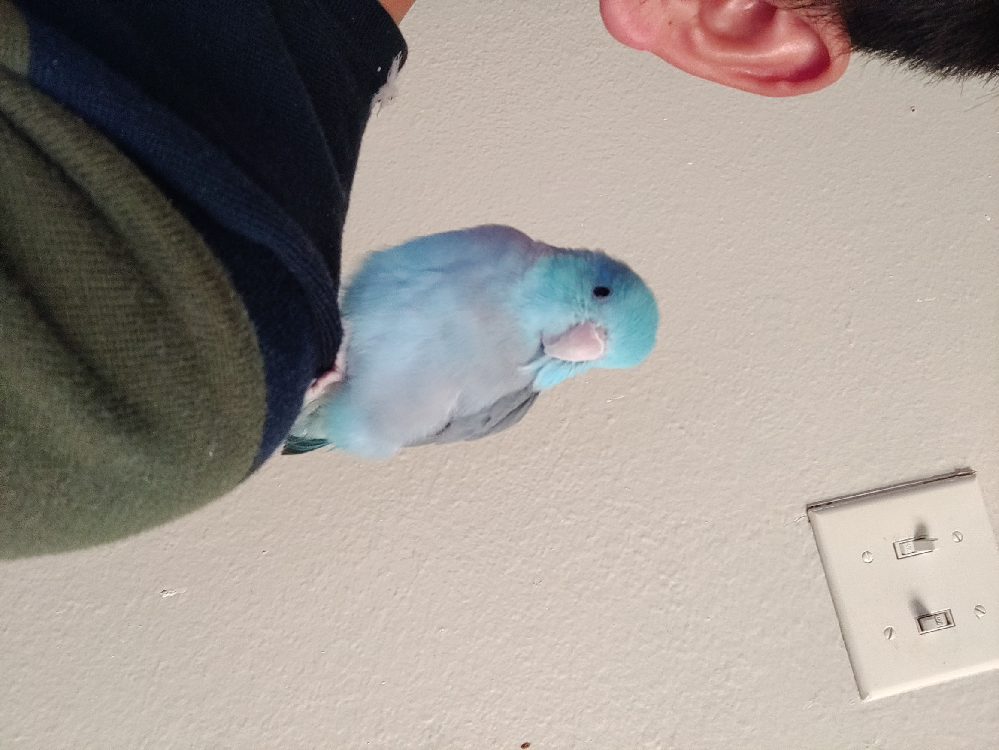
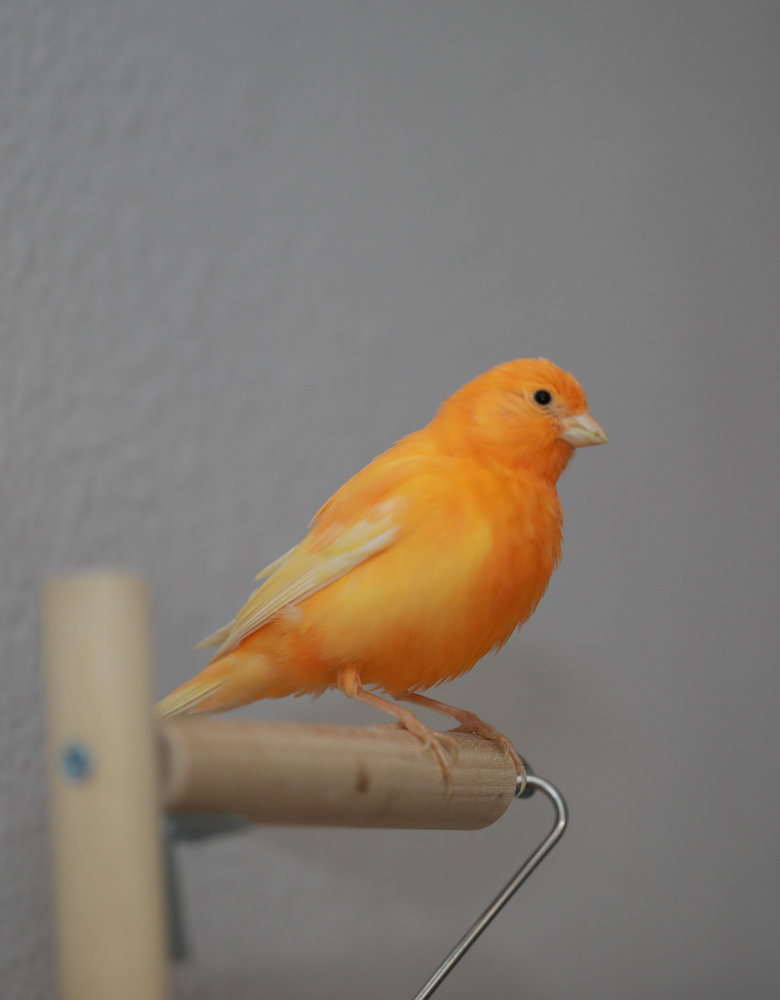
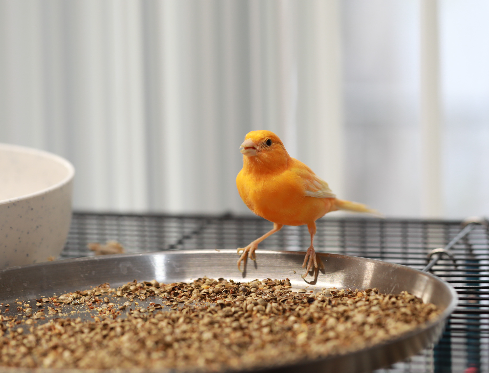

+++
title = "Personal Life"

+++

I am an animal lover. I live with many pets.

First, let's meet my adorable parrotlet Smurf. He is a two year old boy and he can say a few words, such as "Peekaboo", "Birdie Birdie", and "Pikachu". Smurf loves hemp seeds and millet sprays. Parrotlets have tiny body but big personality. They are very smart creatures and not as loud as many other parrots.

Smurf likes standing on my shoulder.

This is cotton ball, Smurf's girlfriend. She is not as tame as Smurf is, but she is a really nice bird.

The lovely couple.

Here is my beautiful canary. She always steals Smurf's hemp seeds.

This is my box turtle and his name is Dumpling. He was donated to me by a friend who moved to Austin in 2021. By then he was just a quarter size hatchling. Now he is already as big as my palm.

